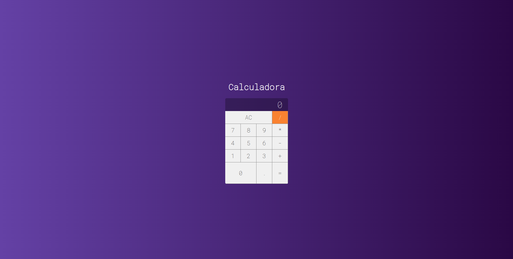

# Calc In ReactJs

This is one of my first reactjs projects, a simple calc, where I watched some classes from the channel [Cod3er](https://www.youtube.com/@cod3r). It was important to know some basic concepts of the ReactJs.

## Interfaces

The project contains only one screen, the calculator itself.



## Test the project yourself

To run the project locally just clone the repository and run the following commands. You can use the app [here](https://mateusgiroletti.github.io/Calc-in-React-JS/)

Clone on your machine:

```console
git clone https://github.com/mateusgiroletti/Calc-in-React-JS.git
```

Change to project directory and install dependencies via npm:

```console
cd calc-in-react-js && npm i
```

And to run the project:

```console
npm run start
```

Accessing the link provided in the console output.